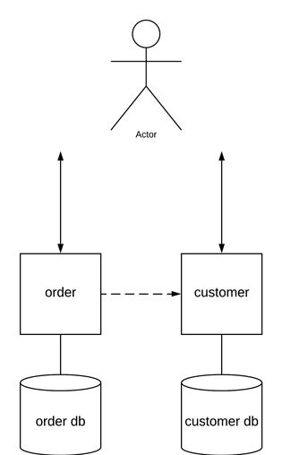

# Order placement system 
Tech task  

[Postman collection](https://www.getpostman.com/collections/d68b6c20a329d4dbdbf4)
## Design

## How to run
| cmd                   | description                       | 
| -------------         |:-------------:                    |
| make                  | build project                     |
| make build            | build project & docker images     |
| make e2e-tests        | run end to end tests with docker  |
| make run              | run application with docker       |
| make down             | down application with docker      |

Examples:
[Swagger-customer](http://localhost:9082/swagger-ui.html) 
[Swagger-order](http://localhost:9081/swagger-ui.html) 
[Tracing](http://localhost:16686)

## Todo
- [x] test:
  - [x] restAssured
  - [x] wireMock
  - [x] coverage 
  - [x] e2e 'testcontainers'
- [x] docker
- [x] CI
- [ ] CD
- [x] automate with Makefile
- [x] swagger doc
- [x] tracing
- [ ] monitoring

## Design improvements
### Security
Requirements:
- cors policies, https, certificates
- encryption, hashing, salt: bcrypt, PBKDF2
- vault

### Scaling
Requirements for horizontal scaling:
- healthcheck(s) for services
- service discovery
- gateway/load balancer
- circuit breaker

